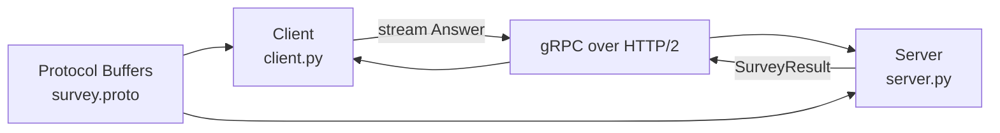

# Лабораторная работа №1  
## Реализация RPC-сервиса с использованием gRPC

Вариант: 15  

---

## Цель работы

Освоить принципы удаленного вызова процедур (RPC) и их применение в распределенных системах. Изучить основы фреймворка gRPC и языка определения интерфейсов Protocol Buffers (Protobuf). Научиться определять сервисы и сообщения с помощью Protobuf. Реализовать клиент-серверное приложение на языке Python с использованием gRPC. Получить практические навыки генерации кода, реализации серверной логики и клиентских вызовов.

---

## Описание варианта

Вариант 15 предусматривает разработку сервиса SurveyService с методом:

SubmitAnswers(stream Answer) returns (SurveyResult)

Тип взаимодействия — Client Streaming RPC. Клиент отправляет поток ответов серверу, после завершения передачи сервер возвращает один итоговый результат.

---

## Архитектура системы

Система построена по клиент-серверной архитектуре. Контракт взаимодействия описан в файле survey.proto. Клиент передаёт поток сообщений серверу через gRPC поверх HTTP/2. После обработки всех сообщений сервер возвращает один итоговый ответ.
