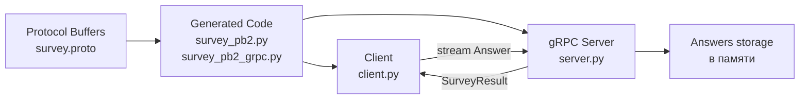

# 📘 Лабораторная работа №1

## Вариант 15

### Тема: gRPC-сервис SurveyService (Client Streaming RPC)

---

## 📌 Задание

Реализовать gRPC-сервис **SurveyService** с методом:

SubmitAnswers(stream Answer)

Метод должен принимать **поток ответов пользователя на вопросы опроса**  
(**Client Streaming RPC**).

Клиент отправляет несколько сообщений `Answer`, после чего сервер обрабатывает полученные данные и возвращает **один итоговый результат**.

---

## 🏗 Архитектура решения

В работе реализована классическая **клиент-серверная архитектура**.

Компоненты системы

Client (client.py)
Отправляет поток ответов на сервер.

Server (server.py)
Принимает ответы клиента, обрабатывает их и возвращает результат.

survey.proto
Контракт взаимодействия между клиентом и сервером.
Описывает сервис и структуры сообщений.

Хранилище ответов
Имитация базы данных (ответы хранятся в памяти программы).

## 🧩 Описание реализации

В рамках лабораторной работы был создан gRPC-сервис SurveyService.

Описание сервиса выполнено в файле [survey.proto](survey.proto)
Сервис содержит метод:

* `SubmitAnswers` — принимает поток ответов пользователя.

Метод использует ключевое слово stream, что позволяет клиенту отправлять несколько сообщений подряд.

После получения всех ответов сервер обрабатывает данные и возвращает итоговый результат.

Таким образом реализуется Client Streaming RPC.

📷 Скриншот: содержимое файла survey.proto

### ⚙ Генерация gRPC-кода

После создания файла survey.proto была выполнена команда:

python -m grpc_tools.protoc -I. --python_out=. --grpc_python_out=. survey.proto

В результате были автоматически созданы файлы:

* [survey_pb2.py](survey_pb2.py)
* [survey_pb2_grpc.py](`survey_pb2_grpc.py)

Эти файлы содержат сгенерированные классы для работы с gRPC и используются клиентом и сервером.

### 🖥 Реализация сервера

Серверная часть реализована в файле [server.py](server.py)

Создан класс SurveyService, который наследуется от SurveyServiceServicer.

В данном классе реализован метод:

`SubmitAnswers` — принимает поток сообщений Answer.

Сервер получает ответы пользователя, сохраняет их в список и после завершения потока выполняет обработку данных.

После обработки сервер возвращает клиенту итоговый результат.

Сервер запускается на порту:

`50051`

и ожидает подключения клиентов.

📷 Скриншот: запущенный сервер

## 💻 Реализация клиента

Клиентская часть реализована в файле [client.py](client.py)

Подключение к серверу выполняется через:

grpc.insecure_channel('localhost:50051')

Клиент формирует список ответов пользователя и отправляет их серверу.

Ответы передаются последовательно как поток сообщений Answer.

После завершения отправки сервер возвращает результат обработки данных.

📷 Скриншот: отправка ответов клиентом

## 🧠 Используемые технологии

* Python 3
* gRPC
* Protocol Buffers
* Virtual Environment (venv)

## 🚀 Запуск проекта
## 1️⃣ Активация виртуального окружения
source venv/bin/activate
## 2️⃣ Запуск сервера
python server.py
## 3️⃣ Запуск клиента
python client.py
## 📊 Результат работы
В результате выполнения лабораторной работы был реализован gRPC-сервис SurveyService, который:

- принимает поток ответов пользователя (Client Streaming RPC);
- обрабатывает полученные данные;
- возвращает итоговый результат клиенту;
- обеспечивает взаимодействие клиента и сервера через gRPC.

## 📌 Вывод

В ходе выполнения лабораторной работы был реализован gRPC-сервис SurveyService. В процессе работы был изучен механизм Client Streaming RPC, при котором клиент отправляет на сервер несколько сообщений с ответами, а сервер после их обработки возвращает один итоговый результат. Также было реализовано взаимодействие клиента и сервера с использованием gRPC. Кроме того, была выполнена генерация кода на основе файла Protocol Buffers. В результате были получены базовые навыки разработки распределённых приложений на языке Python с использованием gRPC.
