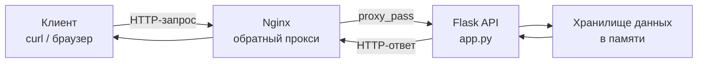

# Лабораторная работа 2. Проектирование и реализация клиент-серверной системы. HTTP, веб-серверы и RESTful веб-сервисы

## Вариант 15

---

## Задание

Выполнить следующие задачи:

1. Анализ HTTP-ответов от ozon.ru при поиске товара.
2. Реализовать REST API "Каталог автомобилей".
3. Настроить Nginx как обратный прокси для Flask API.

---


## Архитектура решения

В работе реализована классическая **клиент-серверная архитектура** с использованием **Nginx** в качестве обратного прокси.


## Компоненты системы

**Клиент (curl / браузер)**  
Отправляет HTTP-запросы к Nginx для получения данных или отправки информации.

**Nginx**  
Выступает в роли обратного прокси. Принимает входящие запросы от клиента и перенаправляет их к Flask-приложению в соответствии с настроенным правилом `location /api/`.

**Flask API ([app.py](app.py))**  
Обрабатывает HTTP-запросы, полученные от Nginx. Реализует бизнес-логику работы с каталогом автомобилей (CRUD операции).

**Хранилище данных**  
Имитация базы данных. Данные о автомобилях (список `cars`) хранятся в оперативной памяти приложения Flask.

---

## Описание реализации

### Анализ HTTP-ответов Ozon

Для анализа HTTP-запросов использовалась утилита `curl` с ключом `-v` (verbose).

```bash
curl -v https://www.ozon.ru/search/?text=iphone
```
Ключ -v показывает полный диалог между клиентом и сервером: технические детали соединения, заголовки запроса, заголовки ответа и тело ответа.

**Что было проанализировано в выводе:**

| Элемент вывода | Значение |
|----------------|----------|
| `> GET /search/?text=iphone HTTP/2` | Запрос, который curl отправил серверу |
| `< HTTP/2 307` | Сервер ответил статусом 307 Temporary Redirect |
| `< server: nginx` | Сервер Ozon использует веб-сервер Nginx |
| `< location: https://www.ozon.ru/search/?text=iphone&__rr=1` | Адрес, на который нужно перенаправить запрос |
| `< content-type: text/html` | Тип содержимого ответа — HTML |
| `* Connected to www.ozon.ru (185.73.193.68)` | IP-адрес сервера Ozon |

**Итоги анализа:**

- Статус-код: **307 Temporary Redirect** (временное перенаправление)
- Сервер: **nginx**
- Тип содержимого: **text/html**
- Перенаправление на: `https://www.ozon.ru/search/?text=iphone&__rr=1`
- Используемый протокол: **HTTP/2**

*Скриншот: результат выполнения `curl -v`*


---

### Реализация REST API «Каталог автомобилей»

API реализован с использованием **Flask**.  
Код приложения находится в файле **[app.py](app.py)**

**Структура объекта Car:**
```json
{
  "id": 1,
  "make": "Toyota",
  "model": "Camry",
  "year": 2020
}
```
## Реализованные методы:

- `GET /api/cars` — получить список автомобилей
- `POST /api/cars` — добавить автомобиль

Запуск сервера выполняется командой:
```bash
python3 app.py
```
Сервер запускается на `http://127.0.0.1:5000`


📷 *Скриншот: запущенный Flask-сервер*

**Проверка API:**

Добавление автомобиля:
```bash
curl -X POST -H "Content-Type: application/json" \
-d '{"make":"Toyota","model":"Camry","year":2020}' \
http://127.0.0.1:5000/api/cars
```
**Получение списка:**
```bash
curl http://127.0.0.1:5000/api/cars
```


Скриншот: POST-запрос к API

**Получение списка по id**
```bash
curl http://127.0.0.1:5000/api/cars/1
```


### Настройка Nginx как обратного прокси

### Настройка Nginx как обратного прокси

**Установка Nginx**

Установка веб-сервера выполнена командой:

```bash
sudo apt install nginx -y
```
**Настройка конфигурации**

Конфигурационный файл `/etc/nginx/sites-available/default` был дополнен следующим блоком:

```nginx
location /api/ {
    proxy_pass http://127.0.0.1:5000;
    proxy_set_header Host $host;
    proxy_set_header X-Real-IP $remote_addr;
}
```
Данная конфигурация указывает Nginx перехватывать все запросы, начинающиеся с `/api/`, и перенаправлять их на Flask-приложение, работающее на порту 5000. Директивы `proxy_set_header` передают Flask оригинальный заголовок Host и реальный IP-адрес клиента.


*Скриншот: проверка конфигурации Nginx*


*Скриншот: запрос через Nginx*

---

##  Используемые технологии

- Python 3
- Flask
- Nginx
- HTTP / REST
- curl

---

## Запуск проекта

Для запуска проекта необходимо активировать виртуальное окружение командой `source venv/bin/activate`, затем запустить Flask-сервер командой `python3 app.py` и Nginx командой `sudo systemctl start nginx`.

---

## Вывод

В ходе выполнения лабораторной работы были изучены принципы работы HTTP-протокола: на примере ответов Ozon разобран статус 307 Temporary Redirect, заголовки server и content-type, а также освоена работа с утилитой curl.

Практически закреплены навыки создания REST API на Flask с реализацией методов GET и POST для работы с каталогом автомобилей.

Освоена настройка Nginx в качестве обратного прокси: добавление конфигурации location /api/, проверка синтаксиса и перезапуск сервера.

Полученные навыки позволяют разрабатывать и разворачивать клиент-серверные приложения с использованием современных веб-технологий.
