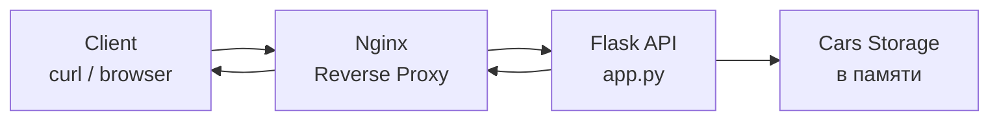

# Лабораторная работа 2. Проектирование и реализация клиент-серверной системы. HTTP, веб-серверы и RESTful веб-сервисы

## Вариант 15

---

## Задание

Выполнить следующие задачи:

1. Анализ HTTP-ответов от ozon.ru при поиске товара.
2. Реализовать REST API "Каталог автомобилей".
3. Настроить Nginx как обратный прокси для Flask API.

---

## Архитектура решения



# Анализ HTTP-ответов Ozon

Для анализа HTTP-запросов использовалась утилита `curl`.

## Получение заголовков ответа
```bash
curl -I https://www.ozon.ru/search/?text=ноутбук
```
В ответе были проанализированы:

- HTTP статус-код (например, 200 OK)
- тип содержимого (content-type)
- используемый сервер (nginx)

## Получение полного ответа
```bash
curl -i https://www.ozon.ru/search/?text=ноутбук
```
Команда позволяет увидеть:
- HTTP-заголовки
- HTML-код страницы

## Скриншоты:
curl -I запрос

curl -i запрос

HTML ответ страницы

## Реализация REST API "Каталог автомобилей"
Был разработан REST API с использованием Flask.

Структура объекта Car
```json
{
  "id": 1,
  "make": "Toyota",
  "model": "Camry",
  "year": 2020
}
```
## Реализованные методы
- GET /api/cars — получить список автомобилей
- POST /api/cars — добавить автомобиль

Код приложения (app.py)
