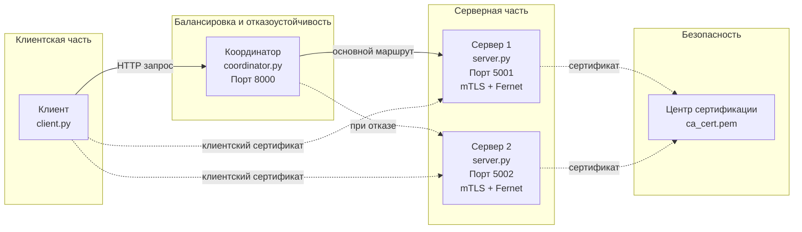

# Лабораторная работа №04
## Реализация механизмов безопасности и отказоустойчивости в распределенной системе

**Студент:** Песенкова Екатерина Романовна

**Группа:** ЦИБ-241

**Вариант:** 15 (Экспорт данных CSV/JSON/XML)

---

## 1. Цели и задачи работы

### Цель работы
Разработать и исследовать распределенную систему, обеспечивающую защищенную передачу данных с использованием взаимной аутентификации (mTLS) и симметричного шифрования, а также демонстрирующую отказоустойчивость через автоматическое переключение между узлами.

## Индивидуальное задание (Вариант 15)

**Экспорт данных.** Реализовать экспорт данных в CSV/JSON/XML на сервере по запросу клиента.

---

## 2. Архитектура системы

### Схема архитектуры


## Компоненты системы

### 1. Клиент (client.py)
- **Назначение:** шифрует сообщение ключом Fernet, отправляет координатору, запрашивает экспорт
- **Порт:** нет (инициирует соединение)
- **Протокол:** HTTP → координатор (8000)

### 2. Координатор (coordinator.py)
- **Назначение:** балансировка нагрузки, отказоустойчивость (failover)
- **Порт:** 8000
- **Протокол:** HTTP (с клиентом) → HTTPS+mTLS (с серверами)

### 3. Сервер 1 (server.py)
- **Назначение:** расшифровка данных, экспорт в JSON/CSV/XML
- **Порт:** 5001
- **Протокол:** HTTPS + mTLS
- **Роль:** основной сервер

### 4. Сервер 2 (server.py)
- **Назначение:** аналогично Серверу 1 (резервный)
- **Порт:** 5002
- **Протокол:** HTTPS + mTLS
- **Роль:** резервный сервер

### 5. Центр сертификации (CA)
- **Назначение:** подпись сертификатов сервера и клиента
- **Файлы:** `ca_cert.pem`, `ca_key.pem`

### 6. Ключ Fernet
- **Назначение:** симметричное шифрование данных
- **Файл:** `encryption_key.txt`
- **Алгоритм:** AES-128-CBC + HMAC-SHA256

---
## Инструкция по запуску

### 1. Установка зависимостей
```bash
pip install flask cryptography requests
```
### 2. енерация сертификатов
```bash
chmod +x generate_certificates.sh
./generate_certificates.sh
```
### 3. Генерация ключа Fernet
```bash
python3 generate_key.py
```
### 4. Запуск компонентов
```bash
# Терминал 1
python3 server.py 5001

# Терминал 2
python3 server.py 5002

# Терминал 3
python3 coordinator.py

# Терминал 4
python3 client.py
```
---
## Демонстрация работы системы

### Скриншот 1: Запущенные серверы и координатор

*[Вставьте скриншот]*

**Подпись:** Запущены [Сервер 1](server.py) (порт 5001), [Сервер 2](server.py) (порт 5002) и [Координатор](coordinator.py) (порт 8000).

---

### Скриншот 2: Отправка сообщения и экспорт данных

*[Вставьте скриншот]*

**Подпись:** [Клиент](client.py) отправляет сообщение "hello", координатор направляет запрос на Сервер 1, сервер возвращает ответ. После обработки запроса автоматически экспортируются данные в выбранном формате.

*[Вставьте скриншот с содержимым экспортированного файла]*

**Подпись:** Содержимое экспортированного файла.

---

### Скриншот 3: Остановка Сервера 1

*[Вставьте скриншот]*

**Подпись:** Сервер 1 остановлен. Координатор выводит сообщение "Server https://127.0.0.1:5001 failed" и автоматически переключается на Сервер 2 (порт 5002). Сервер 2 успешно обрабатывает запрос.

---

### Скриншот 4: Повторный запуск Сервера 1

*[Вставьте скриншот]*

**Подпись:** Сервер 1 снова запущен. Координатор снова направляет запросы на Сервер 1.


## Структура проекта

*[Вставьте скриншот содержимого папки lab_04]*

## Выводы

В ходе выполнения лабораторной работы:

1. **Настройка PKI.** Сгенерированы сертификаты X.509 для центра сертификации (CA), серверов и клиента с использованием OpenSSL.

2. **Реализация безопасности.** Настроены HTTPS-соединения с взаимной аутентификацией (mTLS). Данные шифруются симметричным алгоритмом Fernet (AES-128-CBC + HMAC-SHA256).

3. **Разработка компонентов.** Реализованы:
   - [Сервер](server.py) — обработка и расшифровка данных, экспорт в JSON/CSV/XML
   - [Клиент](client.py) — шифрование, отправка запросов
   - [Координатор](coordinator.py) — балансировка нагрузки и failover

4. **Обеспечение отказоустойчивости.** Координатор при недоступности Сервера 1 (порт 5001) выводит сообщение "Server failed" и автоматически переключается на Сервер 2 (порт 5002). Клиент не замечает переключения.

5. **Индивидуальное задание (Вариант 15).** Реализован экспорт данных в форматах JSON, CSV и XML по запросу клиента.

**Итог:** Система обеспечивает безопасную передачу данных, проверку подлинности (mTLS), отказоустойчивость и балансировку нагрузки.
