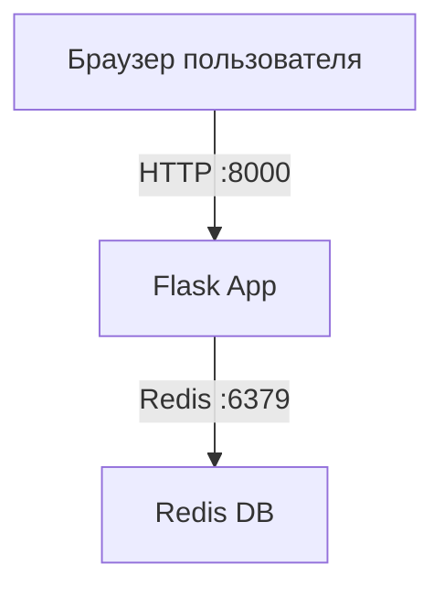

# Лабораторная работа №05  
# Проектирование и реализация комплексной микросервисной системы с использованием Docker Compose

---

## Студент

- ФИО: Песенкова Екатерина
- Группа: ЦИБ-241
- Вариант: 15

---

# Цель работы

Научиться:

- запускать многоконтейнерные приложения;
- организовывать взаимодействие между сервисами;
- использовать Docker Compose для оркестрации;
- изменять бизнес-логику и инфраструктуру проекта;
- работать с Redis как с внешним сервисом хранения данных.

---

# Индивидуальное задание

Для варианта 15 необходимо:

- добавить логирование в консоль `print("New request")`;
- изменить имя контейнера веб-сервиса на `biz-app`;
- изменить базовый образ на `python:3.7-alpine`.

---

# Бизнес-кейс

## «Счетчик посетителей стенда»

Необходимо создать веб-приложение:

- Flask отображает страницу;
- Redis хранит количество посещений;
- счетчик не сбрасывается при перезапуске web-сервиса.

---

# Архитектура проекта



---

# Теоретические сведения

## Docker Image

Docker Image — шаблон приложения, содержащий:

- исходный код;
- библиотеки;
- зависимости;
- настройки запуска.

---

## Container

Контейнер — запущенный экземпляр Docker-образа.

---

## Docker Compose

Docker Compose позволяет запускать несколько контейнеров одной командой через файл:

```text
docker-compose.yml
```

---

## Redis

Redis — быстрое in-memory хранилище данных.

В данной лабораторной работе Redis используется для хранения счетчика посещений веб-приложения.

---

# Ход выполнения работы

## 1. Создание проекта

Была создана рабочая директория проекта:

```bash
mkdir lab_05
cd lab_05
```

---

## 2. Создание файла requirements.txt

Был создан файл `requirements.txt` со списком необходимых зависимостей:

```text
Flask==2.0.1
Werkzeug==2.2.3
redis==4.6.0
```

Используемые библиотеки:

- Flask — создание веб-приложения;
- Werkzeug — библиотека для работы Flask;
- redis — подключение к Redis.

---

## 3. Создание файла app.py

Был создан файл `app.py`, содержащий код Flask-приложения.

Приложение выполняет следующие функции:

- принимает HTTP-запросы;
- подключается к Redis;
- увеличивает счетчик посещений;
- отображает количество посещений пользователю.

Также в рамках варианта 15 было добавлено логирование запросов:

```python
print("New request", flush=True)
```

При каждом открытии страницы в логах контейнера отображается сообщение:

```text
New request
```

---

## 4. Создание Dockerfile

Был создан файл `Dockerfile` для сборки Docker-образа Flask-приложения.

Содержимое файла:

```dockerfile
FROM python:3.7-alpine

WORKDIR /code

COPY requirements.txt requirements.txt

RUN pip install -r requirements.txt

COPY . .

CMD ["python", "app.py"]
```

В рамках индивидуального задания был изменен базовый Docker-образ:

```dockerfile
FROM python:3.7-alpine
```

---

## 5. Создание docker-compose.yml

Был создан файл `docker-compose.yml`.

Docker Compose используется для запуска нескольких контейнеров одной командой.

Содержимое файла:

```yaml
services:

  web:
    build: .

    container_name: biz-app

    ports:
      - "8000:5000"

    depends_on:
      - redis

  redis:
    image: redis:alpine
```

В рамках варианта 15 было изменено имя контейнера веб-сервиса:

```yaml
container_name: biz-app
```

---

## 6. Сборка и запуск проекта

Для сборки и запуска контейнеров использовалась команда:

```bash
docker compose up -d --build
```

После запуска Docker Compose:

1. создает сеть проекта;
2. запускает контейнер Redis;
3. собирает Docker-образ Flask-приложения;
4. запускает контейнер `web`.

---

# Принцип работы приложения

После открытия страницы:

```text
http://localhost:8000
```

происходит следующий процесс:

1. браузер отправляет HTTP-запрос Flask-приложению;
2. Flask получает запрос;
3. в консоль выводится сообщение `New request`;
4. Flask обращается к Redis;
5. Redis увеличивает значение ключа `hits`;
6. Flask получает новое значение счетчика;
7. пользователю отображается обновленное количество посещений.

---

# Проверка работы проекта

## Проверка контейнеров

Использовалась команда:

```bash
docker compose ps
```

В результате оба контейнера имели статус `running`.

---

## Проверка работы веб-приложения

В браузере был открыт адрес:

```text
http://localhost:8000
```

При обновлении страницы счетчик посещений увеличивался.

---

## Проверка Redis

Для проверки значения счетчика использовались команды:

```bash
docker compose exec redis redis-cli
```

Получение значения:

```bash
GET hits
```

---

## Проверка логов

Для просмотра логов использовалась команда:

```bash
docker compose logs -f web
```

В логах отображались сообщения:

```text
New request
```

что подтверждает работу логирования запросов.

---

# Использованные технологии

- Docker;
- Docker Compose;
- Python;
- Flask;
- Redis.

---

# Вывод

В ходе лабораторной работы было разработано многоконтейнерное веб-приложение с использованием Docker Compose.

Были получены навыки:

- создания Docker-образов;
- запуска многоконтейнерных приложений;
- настройки Docker Compose;
- организации взаимодействия контейнеров;
- использования Redis как внешнего хранилища данных;
- реализации логирования запросов внутри контейнера.

В результате было успешно реализовано веб-приложение со счетчиком посещений и логированием входящих запросов.
